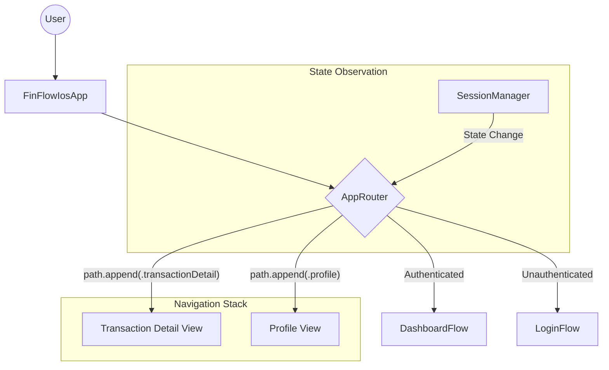

# 🏗️ Architecture Overview

## Full Architecture Stack

```
┌─────────────────────────────────────────────────────────────────┐
│                          App Layer                               │
│  ┌──────────────────────────────────────────────────────────┐  │
│  │              FinFlowIosApp (Entry Point)                  │  │
│  └────────────────────────┬─────────────────────────────────┘  │
│                            │                                     │
│  ┌────────────────────────▼─────────────────────────────────┐  │
│  │            DependencyContainer (DI)                       │  │
│  │  • Network Config  • Token Store  • SessionManager       │  │
│  │  • Repositories    • Use Cases    • ViewModels           │  │
│  └────────────────────────┬─────────────────────────────────┘  │
│                            │                                     │
│  ┌────────────────────────▼─────────────────────────────────┐  │
│  │               AppRouter (Router Pattern)                  │  │
│  │  • NavigationStack State  • NavigationPath               │  │
│  │  • Deep Link Handling     • Auth State Observation       │  │
│  └────────────────────────┬─────────────────────────────────┘  │
│                            │                                     │
└────────────────────────────┼────────────────────────────────────┘
                             │
┌────────────────────────────▼─────────────────────────────────────┐
│                    Presentation Layer                             │
│  ┌─────────────────────┐              ┌─────────────────────┐   │
│  │   LoginView         │              │  DashboardView      │   │
│  │  ┌───────────────┐  │              │ ┌────────────────┐ │   │
│  │  │ LoginViewModel│  │              │ │DashboardViewMod│ │   │
│  │  └───────────────┘  │              │ └────────────────┘ │   │
│  └─────────────────────┘              └─────────────────────┘   │
│            │                                   │                  │
└────────────┼───────────────────────────────────┼──────────────────┘
             │                                   │
┌────────────▼───────────────────────────────────▼──────────────────┐
│                      Domain Layer                                 │
│  ┌──────────────────────────────────────────────────────────┐   │
│  │                    Use Cases                              │   │
│  │  ┌────────────────┐  ┌─────────────────┐  ┌───────────┐ │   │
│  │  │ LoginUseCase   │  │GetProfileUseCase│  │LogoutUseC │ │   │
│  │  └────────────────┘  └─────────────────┘  └───────────┘ │   │
│  └──────────────────────────┬───────────────────────────────┘   │
│                              │                                   │
│  ┌──────────────────────────▼───────────────────────────────┐   │
│  │           Repository Protocols                            │   │
│  │  • AuthRepositoryProtocol                                 │   │
│  │  • DashboardRepositoryProtocol                            │   │
│  └──────────────────────────┬───────────────────────────────┘   │
└─────────────────────────────────────────────────────────────────┘
                              │
┌─────────────────────────────▼─────────────────────────────────────┐
│                        Data Layer                                 │
│  ┌──────────────────────────────────────────────────────────┐   │
│  │              Repository Implementations                   │   │
│  │  • AuthRepository                                         │   │
│  │  • DashboardRepository                                    │   │
│  └──────────────────────────┬───────────────────────────────┘   │
│                              │                                   │
│  ┌──────────────────────────▼───────────────────────────────┐   │
│  │                  Network Layer                            │   │
│  │  • APIClient      • HTTPClient      • Token Management    │   │
│  └──────────────────────────┬───────────────────────────────┘   │
└─────────────────────────────────────────────────────────────────┘
                              │
                              ▼
                    ┌──────────────────┐
                    │   Backend API    │
                    │  (Spring Boot)   │
                    └──────────────────┘
```

## Module Dependencies & Project Structure

### Frontend (iOS - Modular Monolith)

```
FinFlow_Project/
├── FinFlowIos/                    # Main App Target
│   ├── App/                       # App Entry Point (@main)
│   ├── Core/
│   │   ├── Configuration/         # App Config (Environment)
│   │   ├── DI/                    # Dependency Container
│   │   └── Navigation/            # AppRouter (Router Pattern)
│   └── Resources/                 # Assets, Info.plist
│
└── Packages/                      # Swift Packages (Modular Features)
    ├── FinFlowCore/              # Core/Shared Module
    │   └── Sources/FinFlowCore/
    │       ├── Network/          # API Client & Config
    │       ├── Navigation/       # Route Enums & Types
    │       ├── Error/            # AppErrorHandler
    │       └── Storage/          # Keychain & UserDefaults
    │
    ├── Identity/                 # Auth Feature Module
    │   └── ... (Domain, Data, Presentation)
    │
    └── Dashboard/                # Dashboard Feature Module
        └── ... (Domain, Data, Presentation)
```

### Backend (Spring Boot - Clean Architecture)

```
backend/
├── src/main/java/com/finflow/backend/
│   ├── common/                    # Shared configurations & Utilities
│   │   ├── config/               # WebConfig, Swagger
│   │   ├── exception/            # Global Exception Handling
│   │   └── versioning/           # API Versioning Strategy
│   │
│   └── modules/                   # Feature Modules
│       ├── identity/
│       │   ├── AuthController.java   # API Endpoint (Presentation)
│       │   ├── usecase/              # Business Logic (Application)
│       │   ├── domain/               # Core Entity & Repository Interfaces
│       │   └── internal/             # Implementation (Security, JPA Repositories)
│       └── ...
```

## Navigation Architecture (iOS 16+ Modern Stack)

The project uses the **Router Pattern** coupled with SwiftUI's **NavigationStack**.

1.  **Direct State Navigation**: Not using Coordinators (Imperative). Using `NavigationPath` (Declarative).
2.  **AppRouter**: A single Source of Truth for navigation state (`@Published var path`).
3.  **AppRoute Enum**: Type-safe definition of all screens in `FinFlowCore`.
4.  **View Factory**: `FinFlowIosApp` acts as the Root Composer, mapping `AppRoute` to real Views via `.navigationDestination(for:)`.



## Key Design Patterns Used

1.  **Router Pattern** - Decoupled navigation logic using `NavigationStack`.
2.  **Observer Pattern** - `AppRouter` observes `SessionManager` to auto-switch flows (Login <-> Main).
3.  **Dependency Injection (DI)** - Centralized `DependencyContainer` for injecting Services/ViewModels.
4.  **Clean Architecture** - Strict separation of concerns (Presentation -> Domain -> Data).
5.  **Repository Pattern** - Abstraction over Network/DB data sources.
6.  **Factory Pattern** - Used in `DependencyContainer` to create ViewModels and UseCases.

---

_Architecture Status: Updated Jan 2026_
_Alignment: ✅ iOS 16+ Best Practices | ✅ Spring Boot Modular Monolith_
